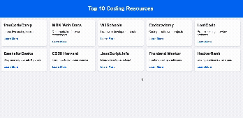

# Web Development Project 1 - Top 10 Learning Platforms

Submitted by: **Bigyan Timalsina**

This web app: **Showcases the top 10 learning platforms in a responsive card format.**

Time spent: **2 hours spent in total**

## Required Features

The following **required** functionality is completed:

- [x] **The app has a cohesive, unique theme for events or resources relevant to a specific community**
  - [x] Header/title describing the theme is displayed
- [x] **At least 10 unique events or resources are displayed in a responsive card format**
  - [x] There are at least 10 cards displayed 
  - [x] The cards are displayed in an organized format (grid layout)
  - [x] Each card includes some information about the resource

The following **optional** features are implemented:

- [x] Buttons or links to a related resource are on each card component
  - [x] All cards have buttons or links in addition to text
- [x] The site is responsive for both desktop and mobile formats
  - [x] Web app is shown in a mobile format
  - [x] **Video Walkthrough Special Instructions**: Used Chrome Developer Tools’ "Toggle Device" button to demonstrate responsiveness in both desktop and mobile formats.

The following **additional** features are implemented:

* None

## Video Walkthrough

Here’s a walkthrough of implemented required features:

GIF created with [Kap](https://getkap.co/) on macOS  

## Notes

Describe any challenges encountered while building the app:

- Figuring out how to make the cards responsive for both desktop and mobile layouts.

## License

    Copyright 2025 Bigyan Timalsina

    Licensed under the Apache License, Version 2.0 (the "License");
    you may not use this file except in compliance with the License.
    You may obtain a copy of the License at

        http://www.apache.org/licenses/LICENSE-2.0

    Unless required by applicable law or agreed to in writing, software
    distributed under the License is distributed on an "AS IS" BASIS,
    WITHOUT WARRANTIES OR CONDITIONS OF ANY KIND, either express or implied.
    See the License for the specific language governing permissions and
    limitations under the License.
